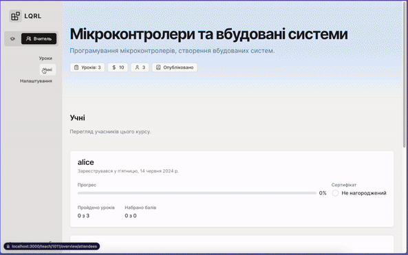
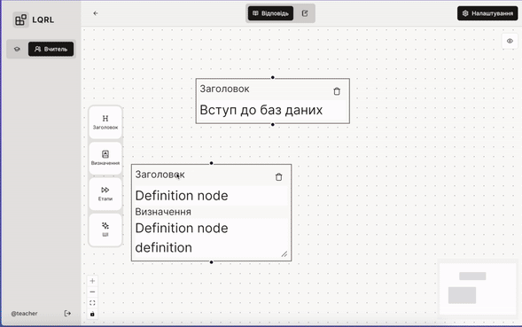

# LQRL
> Learn Quickly, Remember Longly

## Getting Started

First, generate client backend hooks based on OpenAPI schema:

```bash
kubb
```

Then, run the development server:

```bash
npm run dev
```

Open [http://localhost:3000](http://localhost:3000) with your browser to see the result.

AI Diagram generation requires OpenAI API key:
create `.env.local` file with the following content:
```bash
OPENAI_API_KEY=your_openai_api_key
```

## UI preview

### Lessons management


### Diagram UI

